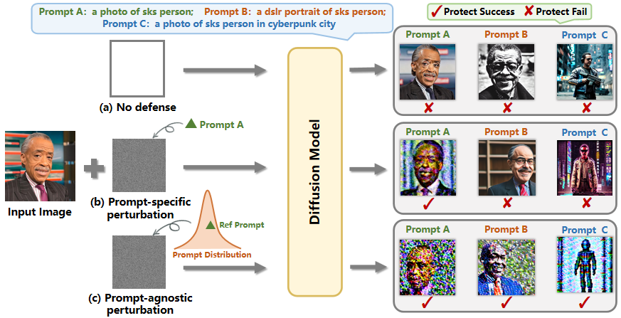

# Official PyTorch implementation of "PAP：Prompt-Agnostic Adversarial Perturbation for Customized Diffusion Models"  (NIPS'24)
<a href="https://vancyland.github.io/PAP.github.io/"></a>
<a href="https://www.arxiv.org/abs/2408.10571"></a>


<div align="center">
  
  <a href="https://github.com/vancyland" target="_blank">Cong Wan</a> &emsp;
  <a href="https://scholar.google.com.hk/citations?user=9VCIiVcAAAAJ&hl=zh-CN" target="_blank">Yuhang He</a> &emsp;
  <a href="https://scholar.google.com.hk/citations?hl=zh-CN&user=DnNdGckAAAAJ" target="_blank">Xiang Song</a> &emsp;
  <a href="https://scholar.google.com.hk/citations?user=x2xdU7gAAAAJ&hl=zh-CN" target="_blank">Yihong Gong</a>
  <br> <br>
  <a > Xi'an Jiaotong University</a>
</div>
<br>

<div align="center">
    
</div>


> **Abstract**: Diffusion models have revolutionized customized text-to-image generation, allowing for efficient synthesis of photos from personal data with textual descriptions. However, these advancements bring forth risks including privacy breaches and unauthorized replication of artworks. Previous researches primarily center around using “prompt-specific methods” to generate adversarial examples to protect personal images, yet the effectiveness of existing methods is hindered by constrained adaptability to different prompts.
In this paper, we introduce a Prompt-Agnostic Adversarial Perturbation (PAP) method for customized diffusion models. PAP first models the prompt distribution using a Laplace Approximation, and then produces prompt-agnostic perturbations by maximizing a disturbance expectation based on the modeled distribution.
This approach effectively tackles the prompt-agnostic attacks, leading to improved defense stability.
Extensive experiments in face privacy and artistic style protection, demonstrate the superior generalization of PAP in comparison to existing techniques. 


Details of algorithms and experimental results can be found in [our following paper](https://www.arxiv.org/abs/2408.10571):
```bibtex
@article{wan2024prompt,
  title={Prompt-Agnostic Adversarial Perturbation for Customized Diffusion Models},
  author={Wan, Cong and He, Yuhang and Song, Xiang and Gong, Yihong},
  journal={arXiv preprint arXiv:2408.10571},
  year={2024},
}
```
The project page can be found at: https://vancyland.github.io/PAP.github.io/


## 🖋 News
- Code of PAPv1 released! (12.3)
- PAP is accepted by nips24!

## 🏗️ Todo
- [ ] Release PAPv1.5
- [x] Release the PAPv1 code (We have released **the first version** of our code. We welcome any questions or issues you may have and will address them promptly.)
- [x] Release paper

## Environment setup

Our code relies on the [diffusers](https://github.com/huggingface/diffusers) library from Hugging Face 🤗 and Anti-DB(https://github.com/VinAIResearch/Anti-DreamBooth).

Install dependencies:
```shell
cd PAP
conda create -n PAP python=3.9  
conda activate PAP  
pip install -r requirements.txt
pip install modelscope
python -c "from modelscope.hub.snapshot_download import snapshot_download; snapshot_download('AI-ModelScope/stable-diffusion-v1-5', cache_dir='./stable-diffusion/stable-diffusion-v1-5', local_dir='./stable-diffusion/stable-diffusion-v1-5')"
```

Pretrained checkpoints of Stable Diffusion versions can also be **downloaded** from provided links manually in the table below:
<table style="width:100%">
  <tr>
    <th>Version</th>
    <th>Link</th>
  </tr>
  <tr>
    <td>1.5</td>
    <td><a href="https://huggingface.co/runwayml/stable-diffusion-v1-5">stable-diffusion-v1-5</a></td>
  </tr>
</table>

Please put them in `./stable-diffusion/`. 

## How to run

To defense Stable Diffusion version 1.5 (default) with PAP, you can run
```bash
bash scripts/papv2.sh
```

Inference: generates examples with multiple-prompts
```
python infer.py --model_path <path to DREAMBOOTH model>/checkpoint-1000 --output_dir ./test-infer/
```

Thanks Anti-DB(https://github.com/VinAIResearch/Anti-DreamBooth) for their open-source. Our codes are mainly built on them.


